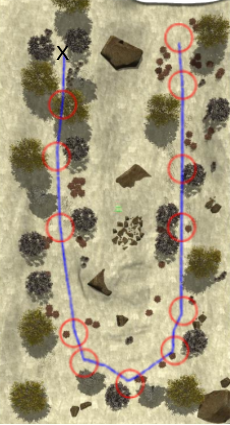

beforecontenttitle     [](/cms/bloques/ajax/add-block/ "Add new block")

NEGS-UGV Dataset
================


The Natural Environment Gazebo Simulation of a Unmanned Ground Vehicle (NEGS-UGV) Dataset is a collection of synthetic multimodal raw and labelled data obtained from Gazebo simulations of an ground vehicle moving on different natural environments. To this end, a Husky mobile robot equipped with a tri-dimensional (3D) Light Detection and Ranging (LiDAR) device, a stereo camera, a Global Navigation Satellite System (GNSS) receiver, an Inertial Measurement Unit (IMU) and wheel tachometers has followed several paths using the Robot Operating System (ROS). Both, points from LiDAR scans, and pixels from camera images, have been automatically labelled into their corresponding object class. For this purpose, unique reflectivity values and flat colours have been assigned to each object present in the modelled environments. As a result, a publicly available dataset, which also includes 3D pose ground-truth, is provided as ROS bag files and as human-readable data. Its possible applications include supervised learning and benchmarking for UGV navigation on natural environments. Moreover, to allow researchers to easily modify the dataset or to directly use the simulations, all the required code has been released too.

Please check the "[readme](https://drive.google.com/file/d/1RfiqF8J7AQS920890TAceiDr5Vv5dzQW/view?usp=sharing)" file for further information.

A full description of the dataset is given in the MDPI Sensors article: [https://doi.org/10.3390/s22155599](https://doi.org/10.3390/s22155599).

#### CITATION

If you use this dataset, please cite it as:
´´´
@article{sanchezNEGS2022,  
AUTHOR = {Sánchez, Manuel and Morales, Jesús and Martínez, Jorge L. and Fernández-Lozano, J. J. and García-Cerezo, Alfonso},  
TITLE = {Automatically Annotated Dataset of a Ground Mobile Robot in Natural Environments via Gazebo Simulations},  
JOURNAL = {Sensors},  
VOLUME = {22},  
YEAR = {2022},  
NUMBER = {15},  
ARTICLE-NUMBER = {5599},  
URL = {https://www.mdpi.com/1424-8220/22/15/5599},  
PubMedID = {35898100},  
ISSN = {1424-8220},  
DOI = {10.3390/s22155599}  
}
´´´        


| ENVIRONMENT        | DESCRIPTION           | PATH  | DATASET LINKS|
|--------------------|-----------------------|-------|--------------|
|Urban   Park  #1      |  <ul><li>Point clouds: 2576</li><li>Stereo images: 6464</li><li>GNSS readings: 10344</li><li>IMU readings: 12650</li><li>Length: 76.08 m</li><li>Duration: 253 s</li></ul>|| <ul><li>ZIP FILE (human readable text format and jpeg images):[Park\_1.zip](http://u.uma.es/dsa/datasetpark_1/)</li>  </br>  </br> <li>ROSBAG :[Park\_1.bag.zip](http://u.uma.es/dsa/datasetpark_1/)</li> </ul>|
|Urban   Park  #2      |  <ul><li>Point clouds: 7089</li><li>Stereo images: 15469</li><li>GNSS readings: 25471</li><li>IMU readings: 12650</li><li>Length: 76.08 m</li><li>Duration: 253 s</li></ul>|| <ul><li>ZIP FILE (human readable text format and jpeg images):[Park\_2.zip](http://u.uma.es/dsb/datasetpark_2/)</li>  </br>  </br> <li>ROSBAG : [Park\_2.bag.zip](http://u.uma.es/dsb/datasetpark_2/)|
|Lake  #1      |  <ul><li>Point clouds: 6216</li><li>Stereo images: 15562</li><li>GNSS readings: 24900</li><li>IMU readings: 31100</li><li>Length: 186.85 m</li><li>Duration: 622 s</li></ul>|| <ul><li>ZIP FILE (human readable text format and jpeg images):[Lake\_1.zip](http://u.uma.es/dr8/datasetlake_1/) </li>  </br>  </br> <li>ROSBAG :[Lake\_1.bag.zip](http://u.uma.es/dr8/datasetlake_1/)</li> </ul>|
|Lake  #2      |  <ul><li>Point clouds: 6343</li><li>Stereo images: 15858</li><li>GNSS readings: 25375</li><li>IMU readings: 31700</li><li>Length: 190.45 m</li><li>Duration: 634 s </li></ul>|| <ul><li>ZIP FILE (human readable text format and jpeg images):[Lake\_2.zip](http://u.uma.es/dr9/datasetlake_2/)</li>  </br>  </br> <li>ROSBAG : [Lake\_2.bag.zip](http://u.uma.es/dr9/datasetlake_2/)|
|Forest  #1      |  <ul><li>Point clouds: 2451</li><li>Stereo images: 6125</li><li>GNSS readings: 9802</li><li>IMU readings: 12250</li><li>Length: 73.38 m</li><li>Duration: 245 s</li></ul>|| <ul><li>ZIP FILE (human readable text format and jpeg images): [Forest\_1.zip](http://u.uma.es/dr4/datasetforest_1/) </li>  </br>  </br> <li>ROSBAG :[Forest\_1\_bag.zip](http://u.uma.es/dr4/datasetforest_1/)</li> </ul>|
|Forest  #2      |  <ul><li>Point clouds: 2451</li><li>Stereo images: 6125</li><li>GNSS readings: 9802</li><li>IMU readings: 12250</li><li>Length: 73.38 m</li><li>Duration: 245 s </li></ul>|| <ul><li>ZIP FILE (human readable text format and jpeg images):[Forest\_2.zip](http://u.uma.es/dr5/datasetforest_2/)</li>  </br>  </br> <li>ROSBAG : [Forest\_2.bag.zip](http://u.uma.es/dr5/datasetforest_2/)</li> </ul>|
|Hill  #1      |  <ul><li>Point clouds: 5145</li><li>Stereo images: 13162</li><li>GNSS readings: 20583</li><li>IMU readings: 25700</li><li>Length: 153.10 m</li><li>Duration: 514 s</li></ul>|| <ul><li>ZIP FILE (human readable text format and jpeg images): [Hill\_1.zip](http://u.uma.es/dr6/datasethill_1/)  </li>  </br>  </br> <li>ROSBAG :[Hill\_1\_bag.zip](http://u.uma.es/dr6/datasethill_1/) </li> </ul>|
|Hill  #2      |  <ul><li>Point clouds: 5111</li><li>Stereo images: 13056</li><li>GNSS readings: 20444</li><li>IMU readings: 25550</li><li>Length: 159.34 m</li><li>Duration: 511 s </li></ul>|| <ul><li>ZIP FILE (human readable text format and jpeg images):[Hill\_2.zip](http://u.uma.es/dr7/datasethill_2/) </li>  </br>  </br> <li>ROSBAG :[Hill\_2.bag.zip](http://u.uma.es/dr7/datasethill_2/)</li> </ul>|


#### SUPPLEMENTARY MATERIAL

**ROS packages and tools**  ([ZIP](http://u.uma.es/dr3/datasetcode/)) This compressed file contains a modified version of Clearpaths Husky stack, the ouster Gazebo and geonav\_transform packages, the natural environment description and launch files, and tools for way-point navigation, data extraction from bags and image annotation.

**Gazebo models** ([ZIP](http://u.uma.es/dr3/datasetcode/)) This file contains the 3D models of the elements present in the synthetic environments.

Paper:

## Dataset overview

The dataset is classified in different folders by scenario and sequence. 
Each sequence has a name corresponding to its content. Inside each sequence 
there are different directories for each "device" (i.e. rgb image, imu, ...).

The different available devices are:

* RGB realistic stereo camera.

* RGB tagged stereo camera.

* Inertial Measurement Unit (IMU).

* LiDAR OS1.

* Global Navigation Satellite System (GNSS).

* Wheel tachometers.

* Pose Ground Truth.


In every case the timestamp is the ROS time recorded in the original rosbag file for that message.

## Images

The dataset contains two sets of stereo images. One corresponds to the RGB spectrum and the other is the label information.
The name convention followed is:

    timestamp_camera.jpg
and for the labeled one:
    timestamp_camera_tag.jpg

The images are stored in different directories named:

    img_right/

    img_right_tag/

    img_left/

    img_left_atg/

The capture ratio is 25 fps for both cameras. The image sizes are 1280x720 pixels for both cameras.  

## IMU

The data from the IMU is stored in a single "imu_data.txt" file. The file stores the messages as successive lines.
The structure for each line is:

    timestamp quaternion.x quaternion.y quaternion.z ang_vel_X ang_vel_Y ang_vel_Z lin_acc_X lin_acc_Y lin_acc_Z

- Roll, pitch and yaw are in rad and about fixed axes XYZ.

- Angular velocities (ang_vel_{X, Y, Z}) are in rad/sec.

- Linear accelerations (lin_acc_{X, Y, Z}) are in m/s².

The capture ratio is 50 .

## OS1 points

Each message is stored in one .csv file as a Nx4 matrix (being N the number of points per message) following the next convention:

    x y z intensity

- x, y and z are the position respect the Velodyne sensor in meters.

- The intensity correponds to one of the 15 classes.

-

They are stored in the folder `lidar/`. The name convention followed is:

    timestamp.csv

In order to open and parse the data from the binary file, the followings commands are examples of use:

* `numpy:`

```python
    import numpy as np
    
    points = np.fromfile(filename, dtype=np.float32).reshape(-1, 4)
```

* `MATLAB:`

```matlab
    fileID = fopen(filename, 'r');
    format = 'float32';
    data = fread(fileID, Inf, format);
    xyzi=reshape(data,4,length(data)/4)';
```

## GNSS

The data from the GNSS are stored in a single "GNSS_data.txt" file. The file stores the messages as successive lines.
The structure for each line is:

    timestamp latitude longitude altitude

## Wheel tachometers

The tachometer readings of each wheel are provided in four separated text files. Each line contains the timestamp and the wheel speed  in rad/s:

    timestamp wheel_speed

## Pose ground truth
The data from the exact positon of the "base_link" of the robot in the Gazebo globlal reference system. The file stores the messages as successive lines.
The structure for each line is:

    timestamp position_x position_y position_z orientation_x orientation_y orientation_z orientation_w
 

Software requirements:
Ubuntu 18.04
Ros Melodic (Desktop-full)

Hardware requirements:
Memory: 32GB RAM
Graphics: Nvidia GTX 1050 

INSTALLATION:

1. Extract models.zip into folder models in gazebo (usually in ~/.gazebo)
2. Create folder simulator into catkin_ws/src
3. Extract worlds.zip into simulator folder
4. Extract husky_ouster.zip into src folder
5. Build packages, e.g., catkin_make
6. Install packages: 

```
ros-melodic-hector-gazebo-plugins 
ros-melodic-robot-localization
ros-melodic-interactive-marker-twist-server
ros-melodic-twist-mux
ros-melodic-joy
ros-melodic-teleop-twist-joy
ros-melodic-geonav-transform
```

7. Add to .bashrc or .zshrc
```
export HUSKY_SENSOR_ARCH="true"
export HUSKY_URDF_EXTRAS=~/catkin_ws/src/husky/husky_description/urdf/sensor_description.urdf
```
USAGE:

1. Change directory
```
cd ~/catkin_ws
```
2. Source 
```
source devel/setup.bashrc
```
or
```
source devel/setup.zshrc
```
3. Launch environment simulation
```
roslaunch natural_environments create_<environment>.launch
```
where environment = forest, hill, lake or park. The loading time may vary between 2 and 10 minutes depending on the complexity of the environment
(simplest - park, lake, hill, forest - most complex)

4. Place husky on the environment
```	
roslaunch natural_environments add_husky_<environment>_#.launch
```
where environment = forest, hill, lake or park and # = 1 or 2

5. Run navigation script
```
rosrun natural_environments fixer_husky.py
```
6. Record ROS messages except camera data using rosbag record
```
rosbag record -O <environment>_#.bag /gazebo/model_states /gazebo_client/back_left_speed /gazebo_client/back_right_speed /gazebo_client/front_left_speed /gazebo_client/front_right_speed /imu/data /imu/data/accel/parameter_descriptions /imu/data/accel/parameter_updates /imu/data/bias  /imu/data/rate/parameter_descriptions /imu/data/rate/parameter_updates  /imu/data/yaw/parameter_descriptions /imu/data/yaw/parameter_updates /navsat/fix  /navsat/fix/position/parameter_descriptions /navsat/fix/position/parameter_updates /navsat/fix/status/parameter_descriptions /navsat/fix/status/parameter_updates /navsat/fix/velocity/parameter_descriptions /navsat/fix/velocity/parameter_updates /navsat/vel /odometry/filtered /os0_cloud_node/imu /os0_cloud_node/imu/accel/parameter_descriptions /os0_cloud_node/imu/accel/parameter_updates  /os0_cloud_node/imu/bias /os0_cloud_node/imu/rate/parameter_descriptions /os0_cloud_node/imu/rate/parameter_updates /os0_cloud_node/imu/yaw/parameter_descriptions /os0_cloud_node/imu/yaw/parameter_updates  /os0_cloud_node/points /tf /tf_static /navigation/objetive_gps
```
NOTE: Gazebo real time factor greatly decreases due to the data recording process.

7. Run way-point generator
```
rosrun natural_environments obj_send_<environment>_#.py
```
where environment = forest, hill, lake or park and # = 1 or 2

8. When path following has finished close rosbag record 

9. Close everything and launch natural environment to record realistic image from stereo camera
```
roslaunch natural_environments create_<environment>.launch
```
where environment = forest, hill, lake or park.


10. Spawn camera for the experiment at position
```
roslaunch natural_environments spawn_camera_<environment>_#.launch
```
where environment = forest, hill, lake or park.

11. Run the following script to capture the realistic stereo camera images:
```
python ~/catkin_ws/src/natural_enviroment/scripts/get_real_cam.py -i <environment>_#.bag -o <environment>_#_real_camera.bag
```
where environment = forest, hill, lake or park.

12. Close Gazebo and launch the natural environment with plain colors
```
roslaunch natural_environments create_<environment>_tagged.launch
```
where environment = forest, hill, lake or park.

13. Spawn camera for the experiment at position
```
roslaunch natural_environments spawn_camera_<environment>_#.launch
```
where environment = forest, hill, lake or park.

14. Run the script to create the tagged stereo camera images:
```
python ~/catkin_ws/src/natural_enviroment/scripts/get_tag_cam.py -i <environment>_#_real_camera.bag -o <environment>_#_complete.bag
```
where environment = forest, hill, lake or park

15. For extracting all data as human readable run the script:
```
python ~/catkin_ws/src/natural_enviroment/scripts/extract_bag.py -i <environment>_#_complete.bag -f <environment>_#_folder
```

