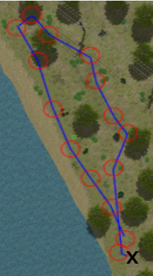

beforecontenttitle     

NEGS-UGV Dataset
================

The Natural Environment Gazebo Simulation of a Unmanned Ground Vehicle (NEGS-UGV) Dataset is a collection of synthetic multimodal raw and labelled data obtained from Gazebo simulations of an ground vehicle moving on different natural environments. To this end, a Husky mobile robot equipped with a tri-dimensional (3D) Light Detection and Ranging (LiDAR) device, a stereo camera, a Global Navigation Satellite System (GNSS) receiver, an Inertial Measurement Unit (IMU) and wheel tachometers has followed several paths using the Robot Operating System (ROS). Both, points from LiDAR scans, and pixels from camera images, have been automatically labelled into their corresponding object class. For this purpose, unique reflectivity values and flat colours have been assigned to each object present in the modelled environments. As a result, a publicly available dataset, which also includes 3D pose ground-truth, is provided as ROS bag files and as human-readable data. Its possible applications include supervised learning and benchmarking for UGV navigation on natural environments. Moreover, to allow researchers to easily modify the dataset or to directly use the simulations, all the required code has been released too.

Please check the "[readme](https://drive.google.com/file/d/1RfiqF8J7AQS920890TAceiDr5Vv5dzQW/view?usp=sharing)" file for further information.

A full description of the dataset is given in the MDPI Sensors article: [https://doi.org/10.3390/s22155599](https://doi.org/10.3390/s22155599).

#### CITATION

If you use this dataset, please cite it as:

@article{sanchezNEGS2022,  
AUTHOR = {Sánchez, Manuel and Morales, Jesús and Martínez, Jorge L. and Fernández-Lozano, J. J. and García-Cerezo, Alfonso},  
TITLE = {Automatically Annotated Dataset of a Ground Mobile Robot in Natural Environments via Gazebo Simulations},  
JOURNAL = {Sensors},  
VOLUME = {22},  
YEAR = {2022},  
NUMBER = {15},  
ARTICLE-NUMBER = {5599},  
URL = {https://www.mdpi.com/1424-8220/22/15/5599},  
PubMedID = {35898100},  
ISSN = {1424-8220},  
DOI = {10.3390/s22155599}  
}
        

#### DATASETS

 **ENVIRONMENT**

**DESCRIPTION**

**PATH**

**DATASET LINKS**

**Urban**

**Park**

 

#1

*   Point clouds: 2576
*   Stereo images: 6464
*   GNSS readings: 10344
*   IMU readings: 12650
*   Length: 76.08 m
*   Duration: 253 s

ZIP FILE (human readable text format and jpeg images):  
     [Park\_1.zip](http://u.uma.es/dsa/datasetpark_1/)

ROSBAG:  
     [Park\_1.bag.zip](http://u.uma.es/dsa/datasetpark_1/)  

#2

*   Point clouds: 7089
*   Stereo images: 15469
*   GNSS readings: 25471
*   IMU readings: 35900
*   Length: 217.51 m
*   Duration: 718 s

ZIP FILE (human readable text format and jpeg images):  
     [Park\_2.zip](http://u.uma.es/dsb/datasetpark_2/) 

ROSBAG:  
     [Park\_2.bag.zip](http://u.uma.es/dsb/datasetpark_2/)

 **Lake** 

#1

*   Point clouds: 6216
*   Stereo images: 15562
*   GNSS readings: 24900
*   IMU readings: 31100
*   Length: 186.85 m
*   Duration: 622 s

ZIP FILE (human readable text format and jpeg images):  
     [Lake\_1.zip](http://u.uma.es/dr8/datasetlake_1/) 

ROSBAG:  
     [Lake\_1.bag.zip](http://u.uma.es/dr8/datasetlake_1/)  

#2

*   Point clouds: 6343
*   Stereo images: 15858
*   GNSS readings: 25375
*   IMU readings: 31700
*   Length: 190.45 m
*   Duration: 634 s

ZIP FILE (human readable text format and jpeg images):  
     [Lake\_2.zip](http://u.uma.es/dr9/datasetlake_2/)

ROSBAG:  
     [Lake\_2.bag.zip](http://u.uma.es/dr9/datasetlake_2/)

 **Forest** 

#1  

*   Point clouds: 2689
*   Stereo images: 6723
*   GNSS readings: 10758
*   IMU readings: 13450
*   Length: 80.52 m
*   Duration: 269 s

ZIP FILE (human readable text format and jpeg images):  
     [Forest\_1.zip](http://u.uma.es/dr4/datasetforest_1/)   

ROSBAG:  
     [Forest\_1\_bag.zip](http://u.uma.es/dr4/datasetforest_1/)

#2  

*   Point clouds: 2451
*   Stereo images: 6125
*   GNSS readings: 9802
*   IMU readings: 12250
*   Length: 73.38 m
*   Duration: 245 s

ZIP FILE (human readable text format and jpeg images):  
     [Forest\_2.zip](http://u.uma.es/dr5/datasetforest_2/)

ROSBAG:  
     [Forest\_2.bag.zip](http://u.uma.es/dr5/datasetforest_2/)

 **Hill** 

#1  

*   Point clouds: 5145
*   Stereo images: 13162
*   GNSS readings: 20583
*   IMU readings: 25700
*   Length: 153.10 m
*   Duration: 514 s

ZIP FILE (human readable text format and jpeg images):  
     [Hill\_1.zip](http://u.uma.es/dr6/datasethill_1/) 

ROSBAG:  
     [Hill\_1\_bag.zip](http://u.uma.es/dr6/datasethill_1/)  

#2  

*   Point clouds: 5111
*   Stereo images: 13056
*   GNSS readings: 20444
*   IMU readings: 25550
*   Length: 159.34 m
*   Duration: 511 s

ZIP FILE (human readable text format and jpeg images):  
    [Hill\_2.zip](http://u.uma.es/dr7/datasethill_2/) 

ROSBAG:  
     [Hill\_2.bag.zip](http://u.uma.es/dr7/datasethill_2/)

#### SUPPLEMENTARY MATERIAL

**ROS packages and tools**  ([ZIP](http://u.uma.es/dr3/datasetcode/)) This compressed file contains a modified version of Clearpaths Husky stack, the ouster Gazebo and geonav\_transform packages, the natural environment description and launch files, and tools for way-point navigation, data extraction from bags and image annotation.

**Gazebo models** ([ZIP](http://u.uma.es/dr3/datasetcode/)) This file contains the 3D models of the elements present in the synthetic environments.

Please check "[readme](https://drive.google.com/file/d/1Rei3DkWTdN5GSL6y8Mn0akdBIYCUh7sY/view?usp=sharing)" file for installation instructions and usage.

